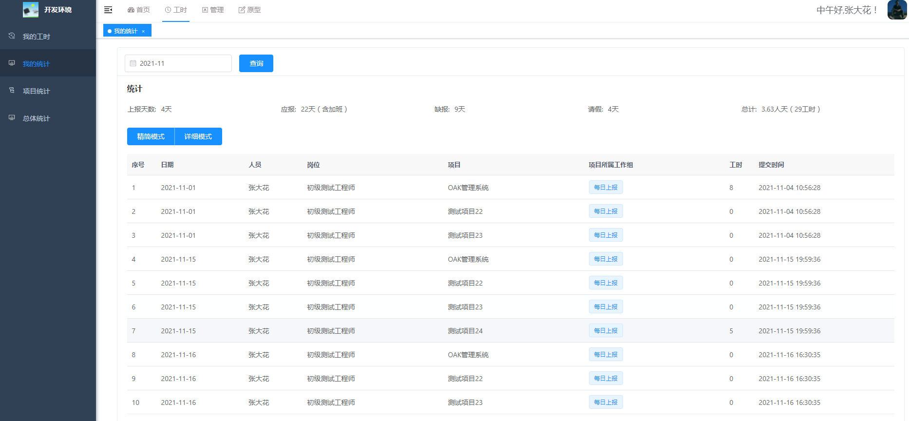
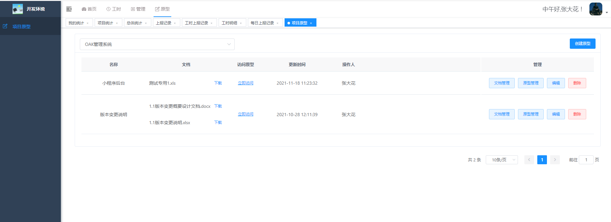
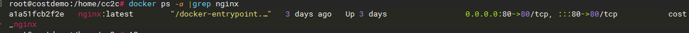
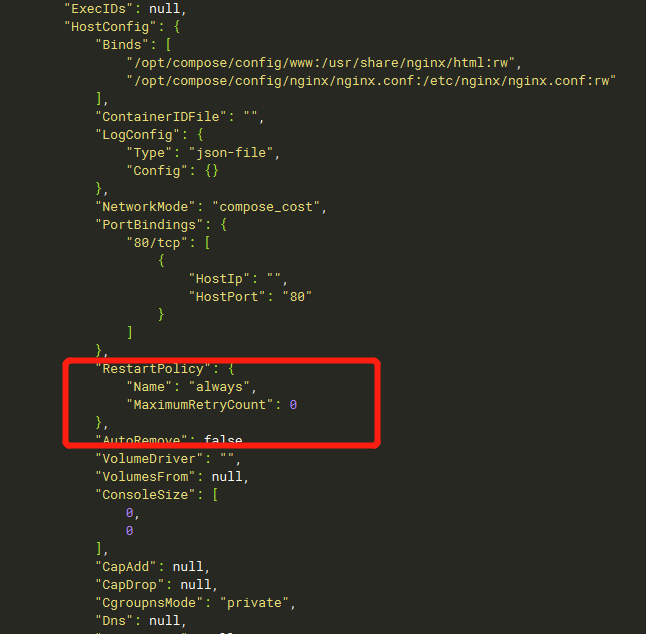

## 平台介绍
无鱼工时管理系统，是一款轻量级工时记录和管理工具，包括项目管理，工时上报，工时日报，工时统计等功能。

无鱼工时管理系统可通过员工工时上报的方式，来记录项目所花费的工时，帮助企业进行项目工时统计、核算人工成本。实时、动态、真实的展示项目投入。
 


## 软件架构
JAVA 1.8 +  MYSQL 8 +VUE
本项目基于前后端分离架构：
服务端：springboot
前端：vue

| 模块  | 说明  |
|---|---|
| wuyu-common | 项目公共模块  |
| wuyu-system  | 系统功能的Module模块  |
| wuyu-framework  | 基础框架  |
| wuyu-admin-web  | 系统功能接口服务模块  |
| wuyu-prototype| 系统工时原型Module模块 |

## 源码说明：
本工程是后端代码，前端代码请看前端工程。


[前端工程源码]( https://gitee.com/wy-soft/wyproject-web)


[后端工程源码]( https://gitee.com/wy-soft/wyproject)


## 功能列表
工时模块

1、我的工时：提交工时、查看详情、修改工时。

2、工时统计：统计详情、按月模式、填报详情。

3、项目统计：项目投入进度、项目工时总计、昨天上报、今日上报、上报记录、工时明细、项目详情等。

4、总体统计：人员上报记录、人员上报详情。


管理模块

1、项目管理：创建项目、添加人员、工时设置、状态管理、删除项目。


2、组织管理：用户管理、角色管理、重置密码、批量删除。


3、职位管理：包括筛选、新增、修改、删除、批量删除等功能。


4、成本管理：成本开关、岗位成本设置、人员成本设置。

## 功能截图

首页


我的工时


提交工时


填报记录


项目统计


数据统计


项目填报详情


原型分享




## 演示
http://demo.wuyusoft.com


| #| 角色 |	 账号 | 	密码    |  权限 |
| :--: | :------: | :------: |:------: | ---------- |
|账号1 |开发者 | 	dev1|	123456|填报工时|
|账号2 |开发者 |	dev2|	123456|填报工时|
|账号3 |项目经理 |	pm1  |	123456 |查看工时统计、管理项目人员|
|账号4 |项目经理 |	fanxian  |	123456 |查看工时统计、管理项目人员|
|账号5 |项目总监|	dm1	|123456| 查看工时统计、创建项目 |


## 使用文档
[文档]( http://www.wuyu-soft.com/doc/index.html)


## 部署方式
方式1、一键部署，使用已经做好docker 镜像进行安装（推荐）。
镜像中已经安装好mysql、redis、nginx 以及nodejs环境，可直接简单修改即可完成进行前端编译，并完成部署。

查看安装说明： [安装说明](https://gitee.com/nineoak/wuyu-project/wikis/%E9%83%A8%E7%BD%B2%E8%AF%B4%E6%98%8E/1.%E9%80%9A%E8%BF%87docker%E9%95%9C%E5%83%8F%E9%83%A8%E7%BD%B2?sort_id=5422808)

方式2、自定义部署
提供了自行部署mysql、redis、nginx等服务的方式，也可以使用原有的服务。需要自行进行前端代码编译。

查看安装说明： [安装说明](https://gitee.com/nineoak/wuyu-project/wikis/%E9%83%A8%E7%BD%B2%E6%89%8B%E5%86%8C/%E9%83%A8%E7%BD%B2%E8%AF%B4%E6%98%8E)

方式3、docker compose方式（推荐）

docker 建议版本23.0.1，可使用docker --version 查看。

compose 建议版本 v2.16.0，可使用docker compose version 查看。


下载代码文件后
```
# 进入install/compose 目录
cd install/compose 
# 设置程序运行权限
sudo  chmod +x conf/app/ctl-tools.sh  conf/app/start.sh  conf/app/wuyu-cost.jar 

# 启动
docker compose up

```
默认管理账号：
admin
默认密码：
12345678


# 不推荐使用仓库最新代码进行生产使用。 master包含最新的代码，可能会有不完整的业功能，可能会无法正常使用或存在bug。


## 问题反馈
1、欢迎大家使用，项目开源免费，无特殊授权要求。

2、交流咨询请加QQ群
功能使用：336197563。

## 相关其他
### 1、swagger

swagger是单独的服务，可通过swagger-ui/index.html路径进行访问 如后端地址是127.0.0.1:8080，swagger访问地址则是 127.0.0.1:8080/swagger-ui/index.html

### 2、代码生成
没有代码生成相关的功能。

### 3、docker方式部署的重启策略
使用compose3.0版本或者docker的，如nginx容器无法在服务器重启后自动启动，可通过如下方式进行修改

```
# 查看nginx容器id
docker ps -a |grep nginx
```



```

# 修改该容器的重启策略
docker update --restart always   a1a51fcb2f2e

# 查看修改效果
docker inspect a1a51fcb2f2e
```

hostconfig下的RestartPolicy属性。



## 感谢
该项目基于若依、ele-admin-ui等相关框架，在此进行感谢。
